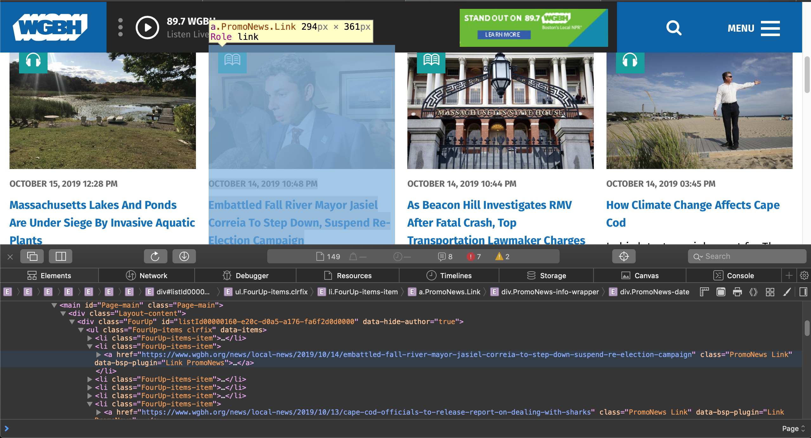

# A primer on web scraping and the Wayback machine by John C. Merfeld

**Note:** The code in this repo is for learning purposes only, and may be in an unstable state of development. For project starter code, only use examples in the README. They are guaranteed to be correct implementations, although they may not work on every system or version.

## Chapter 0: Background on scraping (August 2019)

### Introduction
The internet is a network of computers. It's called the "inter-net" because it was first created as a way to link several computer networks of universities, governments, and private companies all over the United States. To oversimplify things, let's pretend that everybody gets one computer to connect to this network. By "everybody," I mean that you get one computer, I get one computer, Google gets one, Facebook gets one, the City of Boston gets one, etc. So any exchange of information between any two entities is going through their two machines (this actually isn't a drastic oversimplification, but it does make the following descriptions a lot more concise).

Okay, so the internet is everybody's computer in a network together. We can use it to share information. Email, Spotify, and using SSH to login to a remote server are all examples of services built on top of the internet. Another service is the Web, a collection of information in the form of documents made available by computers (again, we're pretending that each person / service just has one internet-facing machine). I point my computer to Facebook's computer, post some text to their server, and they hang onto it, so that when you point your computer to Facebook's, it will show you the text I wrote. These communications adhere to a specific set of rules, called HTTP (HyperText Transfer Protocol). HTTP defines certain "requests," such as GET, PUT, POST, and DELETE. Facebook's computer is programmed to resopnd in specific ways based on the contents of the HTTP requests it receives.

It turns out that writing out HTTP requests is no fun, so our computers use programs called web browsers to write the requests for us. A browser like Safari or Chrome uses an HTTP GET request to fetch a document from some other computer. This might be an mp3 file, a PDF, or, quite often, a page of HTML (HyperText Markup Language). The "HyperText" is key here. Hypertext contains the links that allow websites to share files with one another, and allow users to navigate easily from one location to another.

### How Scrapy works
Of course, the web browser is just there for our convenience. You don't need it to send HTTP requests to other computers. In fact, if your goal is gathering as much information as possible in a structured way, a web browser is a painfully slow and imprecise avenue to take. It would be much more reliable to write your own code to send requests, process the resopnses, and store the output. Then, you could wrap that code in a script, and command it to visit and catalog websites automatically.

Scrapy is a framework for doing exactly this. With relatively little code, Scrapy's Python interface can execute complex instructions for "scraping" web pages as described above. In its simplest form, it can be used as a general-purpose web crawler, visiting links and dumping the HTML pages back to the user. It can also be used in more precise ways, such as reading the DOM (Document Object Model) or structure of HTML pages and writing certain fields back to the local environment.

Scrapy's runtime architecture has two essential componants. There is the "middleware," dictating how it accesses websites, follows links, and makes requests; and the "spider," which is a script dictating how responses are handled. The spider takes the form of a Python class, and generally writes the scraped data to some external file. JSON (JavaScript Object Notation) is a good format for this.

### How the Wayback Machine works
What if we could run Scrapy on the entire Web? That's one of the projects of the Internet Archive, a non-profit digital library. They crawl every major website several times a day and dump the entire contents into a searchable database called the Wayback Machine. You can visit the Wayback Machine in a web browser and view sites exactly as they appeared in the past.

### How they work together
You may already see where we're going with this. If we can visit the Wayback Machine with a browser, could we scrape it in an automated way with Scrapy?

It turns out the answer is yes. The [scrapy-wayback-machine](https://github.com/sangaline/scrapy-wayback-machine) project contains a Scrapy middleware for interfacing with the Wayback Machine. The user adds a time range to their middleware file and writes spiders to handle the responses -- the response from each page will be repeated for each version of that page that exists in the Wayback Machine's storage.

Our goal, then, should be to map out the HTML structure of Boston's news websites, so that we can write spiders that can crawl them throughout our desired time span and write the results into a searchable local database, on which we can perform text mining analysis.

## Chapter 1: A simple scraper (September 2019)

My goal is for this to work if all the steps are followed; it may be enough of a springboard to get you going.

My references for this are the [Scrapy tutorial](https://doc.scrapy.org/en/latest/intro/tutorial.html), the [Wayback Scrapy demo](http://sangaline.com/post/wayback-machine-scraper/), and Scrapy's tutorial on the [xpath traversal language](https://docs.scrapy.org/en/xpath-tutorial/topics/xpath-tutorial.html).

All we need to do to begin is install Scrapy using pip and use it to initialize our directory structure.

```
pip install scrapy
mkdir scrapers
cd scrapers
scrapy startproject globe
```

This will create a `scrapers/globe` folder with the following structure:
```
globe/
    scrapy.cfg            # deploy configuration file

    globe/  /             # project's Python module, you'll import your code from here
        __init__.py

        items.py          # project items definition file

        middlewares.py    # project middlewares file

        pipelines.py      # project pipelines file

        settings.py       # project settings file

        spiders/          # a directory where you'll later put your spiders
            __init__.py
```

All you really need to worry about are the `settings.py` and `spiders/` parts.

Next we'll install the scrapy-wayback-machine package:

```
pip install scrapy-wayback-machine
```

We need to change our `settings.py` to point to this and specify a time range. Let's add these two lines:

```
DOWNLOADER_MIDDLEWARES = {
    'scrapy_wayback_machine.WaybackMachineMiddleware': 5,
}

WAYBACK_MACHINE_TIME_RANGE = (20190921, 20190928)
```

Now, whatever we do in our spider will be redirected to the Wayback machine's records between September 21st, 2019 to September 28th, 2019.

Okay, time to make the spider itself! This code is very simple, but it will return something for us, at least:
```
from datetime import datetime as dt
import scrapy

class GlobeSpider(scrapy.Spider):
    name = 'globe'

    def start_requests(self):
        yield scrapy.Request('https://www.bostonglobe.com')

    def parse(self, response):
        items = []
        for trend in response.xpath('//div[@id="trending_bar_items"]/a[@class="trending_bar_item | color_black float_left"]'):
            try:
                topic = trend.xpath('text()').getall()
                link = trend.xpath('@href').extract()
                items.append({'topic': topic, 'link': link})
            except:
                pass

        if len(items) > 0:
            timestamp = response.meta['wayback_machine_time'].timestamp()
            return {'timestamp': timestamp, 'items': items}

```

Save this as `globeSpider.py`.

So what is this doing? It begins at the Boston Globe's homepage. **Note**: You will need to add code in here to "crawl" the site and actually get the documents of other pages. But this spider will just look at the homepage over time.

It then initializes a list of response objects, and starts reading the HTML on the page. Scrapy has two options for traversing the page's DOM: `css()` or `xpath()`. Both are functions that use quasi-languages to inspect elements of the page; each has its own syntax. I prefer `xpath()` because it is better documented and more flexible.

The `xpath()` string begins with a `'//'`, which tells the function to traverse down as many layers of the document as required until it finds a div with the ID `"trending_bar_items"`. To find this, I used Safari's Web Inspector to look for interesting information in the homepage's HTML.

The next part of the string is an `<a>` or hyperlink element. This is what we want. These link to trending stories on the site (via the `href` element) and include some text, which appears to be some kind of topic tag. There are many such `<a>` elements under our div, so we loop through them and store the link and the tag in a python object, which we append to our list.

Notice how the `xpath()` function is nested. First, I ran it with reference to the who `response` object (the entire page), then I started running it just from the specific div I was looking at. `xpath()` in general shares a lot of syntax with the way a Unix directory structure is navigated.

Finally, we timestamp each set of items with the date it came from, and return that object to whatever called the spider.

To run this, we enter this at the command line:
```
scrapy runspider globeSpider.py -o trends.json
```

This will activate our spider, run it on all the timestamped homepages in our specified range, and save the results in a JSON file.

### Hey that's cool, but how do I actually find that XPath stuff?
Great question. Turns out there's a huge shortcut to finding where in the DOM your element of interest is. Let's say we're curious about the location of a certain story:


On Safari or Chrome, you can right-click the title and select "Inspect" or "Inspect Element." This will open the Element Inspector, seen here:


If you right-click that element in the inspector (or to the blank area just to the right of the text), you should see an option to `Copy->XPath`, which will add the full or relative XPath to your clipboard, and you can insert it into your scraping script! **This takes a ton of time and guesswork out of the scraping process, and I highly recommend you do it this way instead of combing through the HTML yourself, which can be especially complicated on commercial websites.**

### Some final thoughts
This tool is finicky. Scrapy can be hard to debug (please use me as a resource), and with the Wayback scraper in particular, if you screw something up, it will keep trying to scrap each timestamp of the website. If something looks amiss, kill the process with Control-c or Control-/. On the other hand, it's a really impressive piece of software that works hard and runs reliably. Once you figure out a site's HTML structure, gathering your data is as simple as running the `runspider` command.

Stack Overflow is your friend!!

Its default behavior is to append to an existing JSON file, also. So make sure you don't have results from two seperate scrapes in teh same file!

**Big note**: Nothing I just did here directly pertains to the data you're looking for. The flow of your program will need to be more sophisticated-- it should look at specific sections of these news sites, find links to the individual stories, and then pull down the text of those stories. There's room to get creative here; you can use the site's own tagging and timestamps as auxillary data points in your analysis.

We have more to discuss about the ethics of scraping and all that. But for now, just try to get this working and see if you can modify the code to get different data from the site, or even branch off onto other sites!

## Chapter 2: Adding a spider (October 2019)

There is plenty of useful information on the top-level pages of news sites, which are updated frequently. However, to get at the raw text content of individual articles, we need to traverse the site dynamically. If we looked at the layout of, say, [WGBH's website](https://www.wgbh.org), it would look like a tree, with the homepage at the root and several category pages Programs, News, and Arts & Culture one level down. These pages' location in the tree is fixed, but their content is updated frequently to link to new **leaves** on the tree, which represent articles.

Once an article is posted, its content rarely changes (except in certain cases where new information is added, such as a correction or a breaking story). However, it may only be linked to from the site's homepage for a limited time. Therefore, in order to access "leaf-level" articles, we need to use our scraper to find hyperlinks on the site's main page at a certain timestamp and follow them *for the same timestamp* to the relevant article. Only then will we have access to the body text of every article on the site.

A program that does this link-traversal is called a "spider," and it is the mechanism by which the Wayback Machien itself (as well as Google and countless other web applications) gathers and analyzes data. Our mission is to surmount the difficulties in building a Wayback Machine spider; The spider should fetch a list of timestamped links to articles from which our scraper can pull text.

What are some of these difficulties? The primary issue is knowing which links to use. Web pages, especially on commercial sites, often contain dozens of links to irrelevant pages, such as advertisers, sources, or simply pages on the site itself that are not useful. Other links may appear multiple times on the same page, or they may be relative URL links that the scraper cannot use to fetch a new page.

But let's start simple and see where we go. We can use WGBH as our motivating example. Let's take a look at the Local News page and use our HTML element inspector to see how the stories are laid out:


