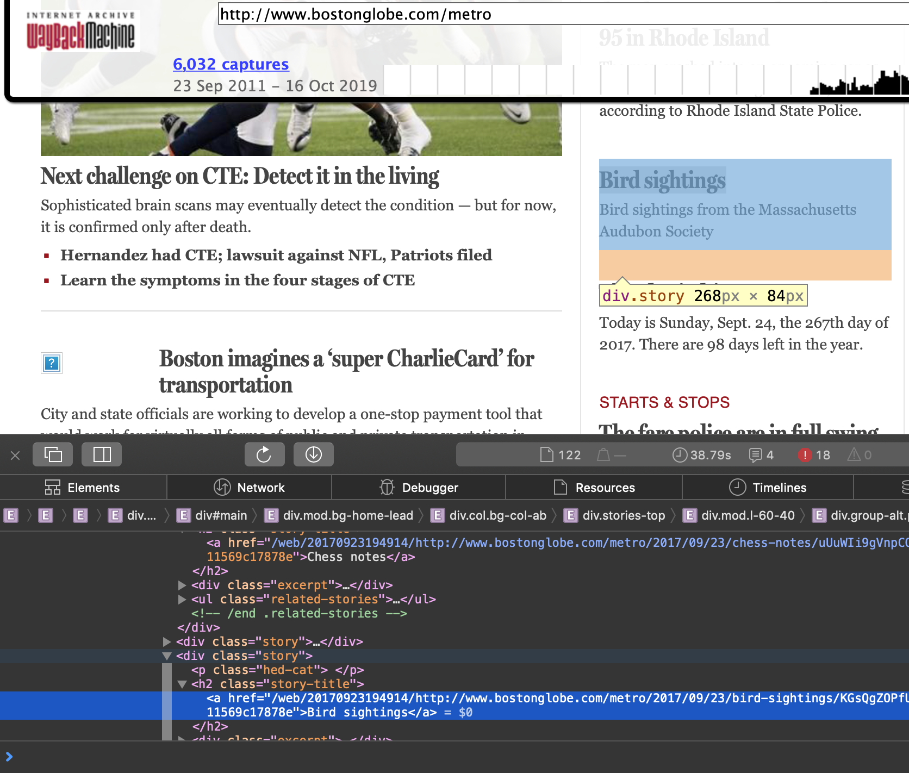

# A primer on web scraping and the Wayback machine by John C. Merfeld

**Note:** The code in this repo is for learning purposes only, and may be in an unstable state of development. For project starter code, only use examples in the README. They are guaranteed to be correct implementations, although they may not work on every system or version.

**Sources:** The [Scrapy tutorial](https://doc.scrapy.org/en/latest/intro/tutorial.html), the [Wayback Scrapy demo](http://sangaline.com/post/wayback-machine-scraper/), Scrapy's tutorial on the [xpath traversal language](https://docs.scrapy.org/en/xpath-tutorial/topics/xpath-tutorial.html), Google's [DOM element inspector tutorial](https://developers.google.com/web/tools/chrome-devtools/dom/), Michael Herman's [Scrapy CrawlSpider blog post](https://mherman.org/blog/recursively-scraping-web-pages-with-scrapy/) the [PyMongo tutorial](https://realpython.com/introduction-to-mongodb-and-python/), the [MongoDB MapReduce documentaiton](https://docs.mongodb.com/manual/core/map-reduce/), and countless [Stack Overflow](https://stackoverflow.com/questions/tagged/scrapy) and [Github](https://gist.github.com/glamp/942a46b7b29bb447805f) posts.

In addition, [Saransh Jain](https://github.com/saranshjain1) taught me a ton about scraping, HTTP, and database clients, and his coding style makes up the foundation of these scripts.

## Chapter 0: Background on scraping

### Introduction
The internet is a network of computers. It's called the "inter-net" because it was first created as a way to link several computer networks of universities, governments, and private companies all over the United States. To oversimplify things, let's pretend that everybody gets one computer to connect to this network. By "everybody," I mean that you get one computer, I get one computer, Google gets one, Facebook gets one, the City of Boston gets one, etc. So any exchange of information between any two entities is going through their two machines (this actually isn't a drastic oversimplification, but it does make the following descriptions a lot more concise).

Okay, so the internet is everybody's computer in a network together. We can use it to share information. Email, Spotify, and using SSH to login to a remote server are all examples of services built on top of the internet. Another service is the Web, a collection of information in the form of documents made available by computers (again, we're pretending that each person / service just has one internet-facing machine). I point my computer to Facebook's computer, post some text to their server, and they hang onto it, so that when you point your computer to Facebook's, it will show you the text I wrote. These communications adhere to a specific set of rules, called HTTP (HyperText Transfer Protocol). HTTP defines certain "requests," such as GET, PUT, POST, and DELETE. Facebook's computer is programmed to resopnd in specific ways based on the contents of the HTTP requests it receives.

It turns out that writing out HTTP requests is no fun, so our computers use programs called web browsers to write the requests for us. A browser like Safari or Chrome uses an HTTP GET request to fetch a document from some other computer. This might be an mp3 file, a PDF, or, quite often, a page of HTML (HyperText Markup Language). The "HyperText" is key here. Hypertext contains the links that allow websites to share files with one another, and allow users to navigate easily from one location to another.

### How Scrapy works
Of course, the web browser is just there for our convenience. You don't need it to send HTTP requests to other computers. In fact, if your goal is gathering as much information as possible in a structured way, a web browser is a painfully slow and imprecise avenue to take. It would be much more reliable to write your own code to send requests, process the resopnses, and store the output. Then, you could wrap that code in a script, and command it to visit and catalog websites automatically.

Scrapy is a framework for doing exactly this. With relatively little code, Scrapy's Python interface can execute complex instructions for "scraping" web pages as described above. In its simplest form, it can be used as a general-purpose web crawler, visiting links and dumping the HTML pages back to the user. It can also be used in more precise ways, such as reading the DOM (Document Object Model) or structure of HTML pages and writing certain fields back to the local environment.

Scrapy's runtime architecture has two essential componants. There is the "middleware," dictating how it accesses websites, follows links, and makes requests; and the "spider," which is a script dictating how responses are handled. The spider takes the form of a Python class, and generally writes the scraped data to some external file. JSON (JavaScript Object Notation) is a good format for this.

### How the Wayback Machine works
What if we could run Scrapy on the entire Web? That's one of the projects of the Internet Archive, a non-profit digital library. They crawl every major website several times a day and dump the entire contents into a searchable database called the Wayback Machine. You can visit the Wayback Machine in a web browser and view sites exactly as they appeared in the past.

### How they work together
You may already see where we're going with this. If we can visit the Wayback Machine with a browser, could we scrape it in an automated way with Scrapy?

It turns out the answer is yes. The [scrapy-wayback-machine](https://github.com/sangaline/scrapy-wayback-machine) project contains a Scrapy middleware for interfacing with the Wayback Machine. The user adds a time range to their middleware file and writes spiders to handle the responses -- the response from each page will be repeated for each version of that page that exists in the Wayback Machine's storage.

Our goal, then, should be to map out the HTML structure of Boston's news websites, so that we can write spiders that can crawl them throughout our desired time span and write the results into a searchable local database, on which we can perform text mining analysis.

**Important note on the ethics of scraping**: The jury is [literally still out](https://www.theverge.com/2019/9/10/20859399/linkedin-hiq-data-scraping-cfaa-lawsuit-ninth-circuit-ruling) on whether web scraping constitutes "unauthorized access" under the Computer Fraud and Abuse Act. My personal opinion is that if you post something on a public website, you shouldn't cry foul when somebody's computer comes and looks at it. That being said, many websites have specific terms that say they don't want to be scraped, and if you don't respect those terms, there are steps they can take to cut off your access. For that reason, scraping with the Wayback Machine is *much safer* than scraping a site directly, since the content is hosted on the Internet Archive's servers. That means that whoever originally posted the content has no way of knowing that you're accessing it; in fact, the Wayback Machine exists for the explicit purpose of documenting what is posted online for informational purposes. So while I believe that web scraping is a perfectly ethical thing to do, I'm telling you that the safest way to do it --if possible-- is with the Wayback Machine.

## Chapter 1: A simple scraper

My goal is for this to work if all the steps are followed; it may be enough of a springboard to get you going.

All we need to do to begin is install Scrapy using pip and use it to initialize our directory structure.

```
pip install scrapy
mkdir scrapers
cd scrapers
scrapy startproject globe
```

This will create a `scrapers/globe` folder with the following structure:
```
globe/
    scrapy.cfg            # deploy configuration file

    globe/  /             # project's Python module, you'll import your code from here
        __init__.py

        items.py          # project items definition file

        middlewares.py    # project middlewares file

        pipelines.py      # project pipelines file

        settings.py       # project settings file

        spiders/          # a directory where you'll later put your spiders
            __init__.py
```

All you really need to worry about are the `settings.py` and `spiders/` parts.

Next we'll install the scrapy-wayback-machine package:

```
pip install scrapy-wayback-machine
```

We need to change our `settings.py` to point to this and specify a time range. Let's add these two lines:

```
DOWNLOADER_MIDDLEWARES = {
    'scrapy_wayback_machine.WaybackMachineMiddleware': 5,
}

WAYBACK_MACHINE_TIME_RANGE = (20190921, 20190928)
```

Now, whatever we do in our spider will be redirected to the Wayback machine's records between September 21st, 2019 to September 28th, 2019.

Okay, time to make the spider itself! This code is very simple, but it will return something for us, at least:
```
from datetime import datetime as dt
import scrapy

class GlobeSpider(scrapy.Spider):
    name = 'globe'

    def start_requests(self):
        yield scrapy.Request('https://www.bostonglobe.com')

    def parse(self, response):
        items = []
        for trend in response.xpath('//div[@id="trending_bar_items"]/a[@class="trending_bar_item | color_black float_left"]'):
            try:
                topic = trend.xpath('text()').getall()
                link = trend.xpath('@href').extract()
                items.append({'topic': topic, 'link': link})
            except:
                pass

        if len(items) > 0:
            timestamp = response.meta['wayback_machine_time'].timestamp()
            return {'timestamp': timestamp, 'items': items}

```

Save this as `globeSpider.py`.

So what is this doing? It begins at the Boston Globe's homepage. **Note**: You will need to add code in here to "crawl" the site and actually get the documents of other pages. But this spider will just look at the homepage over time.

It then initializes a list of response objects, and starts reading the HTML on the page. Scrapy has two options for traversing the page's DOM: `css()` or `xpath()`. Both are functions that use quasi-languages to inspect elements of the page; each has its own syntax. I prefer `xpath()` because it is better documented and more flexible.

The `xpath()` string begins with a `'//'`, which tells the function to traverse down as many layers of the document as required until it finds a div with the ID `"trending_bar_items"`. To find this, I used Safari's Web Inspector to look for interesting information in the homepage's HTML.

The next part of the string is an `<a>` or hyperlink element. This is what we want. These link to trending stories on the site (via the `href` element) and include some text, which appears to be some kind of topic tag. There are many such `<a>` elements under our div, so we loop through them and store the link and the tag in a python object, which we append to our list.

Notice how the `xpath()` function is nested. First, I ran it with reference to the who `response` object (the entire page), then I started running it just from the specific div I was looking at. `xpath()` in general shares a lot of syntax with the way a Unix directory structure is navigated.

Finally, we timestamp each set of items with the date it came from, and return that object to whatever called the spider.

To run this, we enter this at the command line:
```
scrapy runspider globeSpider.py -o trends.json
```

This will activate our spider, run it on all the timestamped homepages in our specified range, and save the results in a JSON file.

### Hey that's cool, but how do I actually find that XPath stuff?
Great question. Turns out there's a huge shortcut to finding where in the DOM your element of interest is. Let's say we're curious about the location of a certain story:


On Safari or Chrome, you can right-click the title and select "Inspect" or "Inspect Element." This will open the Element Inspector, seen here:


*Deprecated note: If you right-click that element in the inspector (or to the blank area just to the right of the text), you should see an option to `Copy->XPath`, which will add the full or relative XPath to your clipboard, and you can insert it into your scraping script! This takes a ton of time and guesswork out of the scraping process, and I highly recommend you do it this way instead of combing through the HTML yourself, which can be especially complicated on commercial websites.*

**Actual note:** While you can use `Copy->XPath` to get your computer's interpretation of the XPath, I don't actually recommend you do it. By all means, do use `Select Element` to find the div you want inside the web inspector, but when it comes to pasting a path into your Scrapy code, I would do something more like `'//div[@class='whatever']'`. The `//` tells Scrapy to ignore all elements of the DOM tree until it gets to the div you're referring to. In most cases, this div will be unique so there's no need to specify further, although if you need to be more specific, you could do something like `'//parent/div[@class='whatever']'`.

### Some final thoughts
This tool is finicky. Scrapy can be hard to debug (please use me as a resource), and with the Wayback scraper in particular, if you screw something up, it will keep trying to scrap each timestamp of the website. If something looks amiss, kill the process with Control-c or Control-/. On the other hand, it's a really impressive piece of software that works hard and runs reliably. Once you figure out a site's HTML structure, gathering your data is as simple as running the `runspider` command.

Stack Overflow is your friend!!

Its default behavior is to append to an existing JSON file, also. So make sure you don't have results from two separate scrapes in the same file!

**Big note**: Nothing I just did here directly pertains to the data you're looking for. The flow of your program will need to be more sophisticated-- it should look at specific sections of these news sites, find links to the individual stories, and then pull down the text of those stories. There's room to get creative here; you can use the site's own tagging and timestamps as auxillary data points in your analysis.

We have more to discuss about the ethics of scraping and all that. But for now, just try to get this working and see if you can modify the code to get different data from the site, or even branch off onto other sites!

## Chapter 2: Adding a crawler and database to our scraper

There is plenty of useful information on the top-level pages of news sites, which are updated frequently. However, to get at the raw text content of individual articles, we need to traverse the site dynamically. If we looked at the layout of, say, [WGBH's website](https://www.wgbh.org), it would look like a tree, with the homepage at the root and several category pages Programs, News, and Arts & Culture one level down. These pages' location in the tree is fixed, but their content is updated frequently to link to new **leaves** on the tree, which represent articles.

Once an article is posted, its content rarely changes (except in certain cases where new information is added, such as a correction or a breaking story). However, it may only be linked to from the site's homepage for a limited time. Therefore, in order to access "leaf-level" articles, we need to use our scraper to find hyperlinks on the site's main page at a certain timestamp and follow them *for the same timestamp* to the relevant article. Only then will we have access to the body text of every article on the site.

A program that does this link-traversal is called a "spider," and it is the mechanism by which the Wayback Machien itself (as well as Google and countless other web applications) gathers and analyzes data. Our mission is to surmount the difficulties in building a Wayback Machine spider; The spider should fetch a list of timestamped links to articles from which our scraper can pull text.

What are some of these difficulties? The primary issue is knowing which links to use. Web pages, especially on commercial sites, often contain dozens of links to irrelevant pages, such as advertisers, sources, or simply pages on the site itself that are not useful. Other links may appear multiple times on the same page, or they may be relative URL links that the scraper cannot use to fetch a new page.

But let's start simple and see where we go. Using the Globe Metro section as our new motivating example, what code can be reused from Chapter 1?

Not as much as I originally hoped, but that's okay! The good news is that we can keep our Scrapy project's existing structure. We'll still define a `Scrapy.Spider` class in Python and run it from the command line. It will use the same `settings.py` and nothing about the Wayback instructions needs to change (unless we want to scrape a different time window). But two major things will change: first, we need to write a different set of rules for how the Spider will gather content, and we should probably write the results down into a database instead of simply appending to a file. These are both significant improvements on the substance of our code, but neither requires many extra lines of code.

### Getting a list of article URLs.

It turns out that Scrapy defines many different `Spider` classes, all of which inherit methods from the base `Spider`. There is much of interest here, but we will limit our discussion to the spider that aids our investigation: the `Scrapy.CrawlSpider` class.

Since it inherits from `Scrapy.Spider`, we can define it identically to our Chpater 1 spider. This time, however, we will add additional data (changes highlighted with comments):

```
from datetime import datetime as dt
from scrapy.spiders import CrawlSpider # different imports

# different class name and type (scrapy is implied by import)
class GlobeSpiderCrawler(CrawlSpider):
    name = 'globecrawler' # new name

    def start_requests(self):
        yield scrapy.Request('https://www.bostonglobe.com')

    def parse(self, response):
        items = []
        for trend in response.xpath('//div[@id="trending_bar_items"]/a[@class="trending_bar_item | color_black float_left"]'):
            try:
                topic = trend.xpath('text()').getall()
                link = trend.xpath('@href').extract()
                items.append({'topic': topic, 'link': link})
            except:
                pass

        if len(items) > 0:
            timestamp = response.meta['wayback_machine_time'].timestamp()
            return {'timestamp': timestamp, 'items': items}

```

Save this to a new file, `globeSpiderCrawling.py`.

Again, because of class inheritance, this is a valid Scrapy spider. The benefit of using a `CrawlSpider`, however, is that we can add `Rules` and a `LinkExtractor`, and this is where things will really start to get fun. (**Note**: This is really getting into Python 3 territory -- some of this is named differently in Python 2 and so the code as written beyond this point might not work if you're running Python 2).

Notice in the code above where we tell the spider to only visit one page: `yield scrapy.Request('https://www.bostonglobe.com')`. We do still need to specify a page as our baseline. Since we're starting on the Metro page, let's populate a new element of the spider:

```
start_urls = ['https://www.bostonglobe.com/metro']
```

Notice from the syntax that we could actually define this as a list of starting URLS. We may want to do this later, but for now, let's just use the one. We also want to add an instruction for the spider to stay on the Globe's website. Using our previous "single computer" metaphor for the internet, this basically tells Scrapy to only accept links to pages from the Boston Globe's computer:

```
allowed_domains = ["bostonglobe.com"]
```

*We don't need to do anything else with this data*. By defining these two fields, Scrapy will know to begin at the local news page and not follow any URLs that go offsite. Now, let's take a look at the page in our browser and use our HTML element inspector to see how the stories are laid out:



We can see that the links to individual articles are nested inside a div class called `story`. What we'd like to do is instruct our spider to look for all of the `story`s on the `start_urls` page and `parse()` them all one at a time. We can accomplish that with the following additional code:

```
from scrapy.spiders import Rule
from scrapy.linkextractors import LinkExtractor

rules = (
    Rule(LinkExtractor(allow = (), restrict_xpaths = ('//div[@class="story"]')),
    callback = "parse_items",
    follow = True),
)
```

This code should be pretty self-explanatory if you've been following the document up until now. One component that may look new is the `callback` parameter. This tells Scrapy which function to use when parsing the `Response` object it gets back after requesting the content of the links at finds inside the `story` elements. In this case, the spider is supposed to use a function called `parse_items()`, which we will define. We've actually used callback functions before; our `parse()` function in the Chapter 1 code was an example of a callback function. We just didn't have to supply it to the `Scrapy.Request` function because it is the default callback function that every spider will try to use. However, when using a `CrawlSpider`, there is a `parse()` function already defined, so we need to define ours with a different name.

(*Note: One wrinkle with all of this that bears mentioning now -- the structures of these sites can and do change. You need to make sure that pages actually look the way your spider thinks they do throughout the time period you're trying to scrape*)

Let's put all of these changes together and see what our spider looks like. I've defined the `parse_items()` method already, but you should look at an article page to see where this `XPath` came from. The `DEPTH_LIMIT` parameter is just a safety mechanism to make sure the spider doesn't fetch a bunch of duplicate articles that are linked to from within stories. I'll also remove parts of the code that we no longer need:

```
from datetime import datetime as dt
from scrapy.spiders import Rule, CrawlSpider
from scrapy.linkextractors import LinkExtractor

class GlobeSpiderCrawler(CrawlSpider):
    name = 'globecrawler'

    allowed_domains = ["bostonglobe.com"]
    start_urls = ['https://www.bostonglobe.com/metro']

    custom_settings = {
        'DEPTH_LIMIT': 5
    }
    rules = (
        Rule(LinkExtractor(allow = (), restrict_xpaths = ('//div[@class="story"]')),
        callback = "parse_items",
        follow = True),
    )

    def parse_items(self, response):
        items = []

        for paragraph in response.xpath('//div[@class="article-text"]/p'):
            try:
                text = paragraph.xpath('text()').getall()
                items.append(text)

            except:
                pass
            # we'd probably want to add some information to this object, like the article title, author, etc.

            if len(items) > 0:
                timestamp = response.meta['wayback_machine_time'].timestamp()
                return {'timestamp': timestamp, 'text': items}
```

This code looks pretty good! We can run it with a command similar to the one we used in Chapter 1, outputting to a JSON file:

```
scrapy crawl globecrawler -o articletext.json
```

### Can we do better than writing to a JSON file?

If we let the above code run for the timespan we specified in `settings.py`, it will produce a potentially enormous JSON array of key value pairs that looks like

```
[
  {timestamp:   <whatever_the_wayback_machine_says>,
        text:   [
          <first paragraph>,
          <second paragraph>,
          <third paragraph>,
          ...,
        ],
  },
...,
]
```

There is nothing semantically incorrect about this approach. We can use Python or some other language to load this file and search it for terms of interest.

But... let's remember how big this file could get. Assuming we scrape multiple years' worth of data from multiple websites, we're now talking about several files containing thousands of objects, each of which contains its own array of many-word paragraphs. Even if loaded into a list of dictionary objects in Python, this would be  difficult to search, not to mention slow. Fortunately, there is a relatively straightforward solution in the form of MongoDB.

To fully understand the advantages of a database over raw files --or to fully describe MongoDB and how it differs from traditional database software-- is beyond the scope of this document. Suffice to say that MongoDB is all of the following:
  - a database designed to store and search for JSON-like objects
  - easy to install and run
  - easy to link to Python
  - well-documented online

Therefore, instead of instructing our spider to write to a JSON file at the command line, we will add a MongoDB database client into the spider code itself. As in chapter 1, I will attempt to describe the installation process as succinctly as possible.

For those familiar with relational (SQL) databases, MongoDB has a similar overall structure but different terminology and syntax. In a relational database, the top-level structure is the "database," which contains a set of "tables," which are themselves made up of many "records," or "rows," each of which must have the same structure. In MongoDB, the top level structure is still a database. But databases in MongoDB contain "collections" instead of tables. A collection is made up of a set of "documents," which are basically JSON objects. Their structure does not have to be consistent within a collection.

If you're using a Mac, the easiest way to download MongoDB is with [Homebrew](https://brew.sh), like this:
```
brew install mongodb
```
If you're using Windows or something else, there are [other options available](https://docs.mongodb.com/v3.4/installation/).

Once you have MongoDB installed, you need to instantiate a MongoDB server. There's a deeper explanation for this that I'm not going to get into. Suffice to see you need to launch something called a "daemon" that will run on a certain network port on your machine (27017) and allow you to insert, update, and read your data. To launch this daemon, open a *new terminal window/tab*, and simply enter
```
mongod
```
Get it? Like MONGODaemon.

Now, MongoDB uses a query language that you can run from the command line with the `mongo` command, but we'll only worry about that once we have data in our database.

The last piece to install is the `PyMongo` module for connecting to our database server from within Python. There are other MongoDB Python libraries that you may find easier to use, but this is the one published by the MongoDB developers and even though it is relatively low-level, it's still quite simple to use. We can install it with pip:
```
pip install pymongo
```

PyMongo allows us to establish connections to the `mongod` daemon listening on port 27017. The best way to do this from a performance standpoint is to create a persistent connection that Python accesses via a "client," so that the connection doesn't need to be recreated every time. We only need a few lines of code to do this:

```
from pymongo import MongoClient

class MongoDB:

    def __init__(self):
        self.db = MongoClient("mongodb://localhost:27017/")

    def get_database(self):
        return self.db

    def get_client(self, db_name):
        return self.db[db_name]
```

Now all we need to do is add an instance of a `MongoDB` class as a member object of our `GlobeSpiderCrawler` class. Our `parse_items()` function can use it to insert records into a collection of documents instead of writing directly to the file!

Putting it all together, we add our client class and database calls to the Scrapy file. This assumes our MongoDB server is already running:

```
from datetime import datetime as dt
from scrapy.spiders import Rule, CrawlSpider
from scrapy.linkextractors import LinkExtractor
from pymongo import MongoClient

class MongoDB:
    """
    we need to create a single persistent connection to database.

    Everytime a client calls us, we can simply return the connection instead of creating
    it again and again.
    """
    def __init__(self):
        self.db = MongoClient("mongodb://localhost:27017/")

    def get_database(self):
        return self.db

    def get_client(self, db_name):
        return self.db[db_name]

class GlobeSpiderCrawler(CrawlSpider):
    name = 'globecrawler'

    db_client = MongoDB()

    allowed_domains = ["bostonglobe.com"]
    start_urls = ['https://www.bostonglobe.com/metro']

    custom_settings = {
        'DEPTH_LIMIT': 5
    }
    rules = (
        Rule(LinkExtractor(allow = (), restrict_xpaths = ('//div[@class="story"]')),
        callback = "parse_items",
        follow = True),
    )

    def parse_items(self, response):
        items = []

        for paragraph in response.xpath('//div[@class="article-text"]/p'):
            try:
                text = paragraph.xpath('text()').getall()
                items.append(text)
            except:
                pass

        if len(items) > 0:
            db = self.db_client.get_client(self.db_name)
            collection = db[self.collection_name]
            timestamp = response.meta['wayback_machine_time'].timestamp()

            document = {'timestamp': timestamp, 'items': items}
            result = collection.insert_one(document)
            return document

```

Some comments on this code: You'll notice that it doesn't ever explicitly name the database or collection we should write to; it simply uses the values stored in `self.db_name` and `self.collection_name`. These are better left to the user to decide, since they may differ from crawl to crawl. Scrapy allows additional arguments to be specified at runtime, and they will automatically be added as member objects (e.g. `self.db_name`) to our `GlobeSpiderCrawler` class.
a
```
scrapy crawl globecrawler -a db_name=globe_db -a collection_name=globe_stories
```

One syntactical benefit of MongoDB is that it will allow us to write to a database and collection whether or not they already exist (if not, it will create them), so the above command will work no matter what names we enter.

Also, pay attention to the last line in `parse_items()`. This uses a MongoDB-specific command called `insert_one()` to add this document to the collection `globe_stories` in the database `globe_db`.

I plan to write more about analyzing this data in Chapter 3, but for now let's just take a look at our mongoDB database at the command line and make sure articles are getting written to it. You'll need to open 3 separate terminal windows/tabs to run this:

```
# window 1, instantiate the MongoDB server:
mongod

# window 2, run the scraper and write to the database:
scrapy crawl globecrawler -a db_name=globe_db -a collection_name=globe_stories

# window 3, run the Mongo shell and look at the database:
mongo
# should show the following:
MongoDB shell version v3.4.2
connecting to: mongodb://127.0.0.1:27017      # <-- this is our mongo daemon
MongoDB server version: 3.4.2
Server has startup warnings:
2019-10-05T12:00:55.982-0400 I CONTROL  [initandlisten]
2019-10-05T12:00:55.982-0400 I CONTROL  [initandlisten] ** WARNING: Access control is not enabled for the database.
2019-10-05T12:00:55.982-0400 I CONTROL  [initandlisten] **          Read and write access to data and configuration is unrestricted.
2019-10-05T12:00:55.982-0400 I CONTROL  [initandlisten]
>

```

That `>` prompt tells you that you're in the Mongo shell and can run queries. Let's try the following:
```
> show dbs
```
This will list out the available databases, including `globe_db`. Let's enter it and see how many stories have been added so far:

```
> use globe_db
> db.globe_stories.count()
7276
```

If you use a command like `db.globe_stories.find()`, you'll actually see all of the text you scraped. But that's an exercise for Chapter 3!

## Chapter 3: Performing analysis on a text dump in MongoDB

**Note** This section is more explicitly geared toward the NAACP teams, but the overall strategy (and especially the code) can be used for any sort of tagged-story approach.

Okay, so let's assume we've done everything up until now. When we left off, we had a wayback scraper writing groups of paragraphs to a MongoDB database.

To make a long story short, there are a number of improvements we need to implement to get ready to do our text analysis. I'll discuss them quickly (but the code below should also serve as a reference):

  1. **Cleaning the input:** The chapter 2 code generated MongoDB documents of the form `{"_id": <some id>, "timestamp": <some timestamp>, "items": [ [some list of lists]]}`. This gets unruly very quickly, so we can use some little Pythonic code to flatten the nested list into a single string for each story. Then, we should remove extraneous newline and tab characters (`\n` and `\t`) and turn the entire string into lowercase (so that word counting works better).
  2. **Tagging the input:** We need to know which neighborhood each story is about, so we can add a tagging function to look in each story for any mention of a neighborhood. *This part of the demo code is incomplete and is just there for proof of concept. Picking the actual list of neighborhoods will require more serious thought.*
  3. **Checking for duplicates:** To try to keep the resulting dataset as clean as possible, we should a duplicate checker (basically, query our database for an identical story, and if it exists, don't insert this new one). I think this slows down the code significantly, but it's good for the overall hygene of our analysis.
  4. **Changing the database structure:** This is the most consequential change. Instead of adding the tags as a document field (i.e. `"tags": ["Back Bay", "Roxbury", ...]`), the *easiest* thing to do is to insert the stories into **separate collections based on their tags**. So there's a master collection that gets a copy of every story, but then each neighborhood gets its own collection for stories that mention that neighborhood. From a data architecture standpoint, this is kind of crazy, since it introduces a ton of duplicate records into the system as a whole. However, it makes the ensuing analysis a lot easier as long as we're careful.

So our new scraper code looks like this:
```
from datetime import datetime as dt
from scrapy.spiders import Rule, CrawlSpider
from scrapy.linkextractors import LinkExtractor
from pymongo import MongoClient
import re

def getTags(s):

    # NOTE: THIS IS NOT AN EXHAUSTIVE LIST OF GEOGRAPHIES IN BOSTON
    neighborhoods = ['Allston', 'Brighton', 'Back Bay', 'North End', 'Roxbury',
                     'Bay Village', 'Beacon Hill', 'Charlestown', 'Chinatown',
                     'Dorchester', 'Downtown', 'East Boston', 'Kenmore', 'Fenway',
                     'Hyde Park', 'Jamaica Plain', 'Mattapan', 'Mission Hill',
                     'Roslindale', 'South Boston', 'South End', 'West End',
                     'West Roxbury', ]   

    tags = []

    for neighborhood in neighborhoods:
        if bool(re.search(neighborhood, s)):
            tags.append(neighborhood)

    return tags

class MongoDB:
    """
    we need to create a single persistent connection to database.

    Everytime a client calls us, we can simply return the connection instead of creating
    it again and again.
    """
    def __init__(self):
        self.db = MongoClient("mongodb://localhost:27017/")

    def get_database(self):
        return self.db

    def get_client(self, db_name):
        return self.db[db_name]

class GlobeSpiderCrawler(CrawlSpider):
    name = 'globecrawler'

    db_client = MongoDB()

    allowed_domains = ["bostonglobe.com"]
    start_urls = ['https://www.bostonglobe.com/metro']

    custom_settings = {
        'DEPTH_LIMIT': 2
    }
    rules = (
        Rule(LinkExtractor(allow = (), restrict_xpaths = ('//div[@class="story"]')),
        callback = "parse_items",
        follow = True),
    )

    def parse_items(self, response):
        items = []
        tags = []

        for paragraph in response.xpath('//div[@class="article-text"]/p'):
        //*[@id="post-1836861"]/div/div/div[2]/div
            try:
                text = paragraph.xpath('text()').getall()
                items.append(text)
            except:
                pass

        # tag and clean the story
        flat_items = [item for sublist in items for item in sublist]
        story = " ".join(flat_items)
        story = story.replace('\n\t ','')
        story = story.replace('\t ','')
        story = story.replace('\n ','')
        story = story.lower()

        tags = getTags(story)


        if len(items) > 0:

            db = self.db_client.get_client(self.db_name)
            timestamp = response.meta['wayback_machine_time'].timestamp()

            master_collection = db[self.collection_name]
            document = {'timestamp': timestamp, 'story': story}

            count = master_collection.count_documents({'story': {'$in': [story]}})
            # primitive duplicate handling
            if count == 0:

                # always insert into master
                master_collection.insert_one(document)
                for tag in tags:
                    collection_by_tag = db[tag.lower().replace(" ", "_")]
                    collection_by_tag.insert_one(document)

            return document

```

We can run this the same way we did above, but we should name a new database:
```
# in one window
mongod
# in another
scrapy crawl globecrawler -a db_name=globe_db_by_neighborhood -a collection_name=master_copy
```

We'll let this run for a while and then open up MongoDB to do some analysis

### What should the analysis look like? (**Also, again, cannot stress this enough, this is geared specifically at the NAACP projects, although the techniques may be useful for other projects**)

The easiest way to analyze text is by doing a word count. Word counting can take many forms, some more complex and subtle than others. For now, I'm just going to talk about how to do it at its most basic level in MongoDB -- which I still believe will be an extremely powerful analytical tool.

So, the short answer is that MongoDB can run JavaScript code, and while we could write our own function for going through a collection and making a data structure mapping each unique word to the number of times it appears in the text, MongoDB provides a convenient framework for us that takes care of most of the hard parts. It's called [MapReduce](https://en.wikipedia.org/wiki/MapReduce).

MapReduce is a really cool programming model that I don't have time to get into in too much detail. Suffice to say that a MapReduce library handles all of the difficult parts of a large processing job and leaves only two functions for the programmer to write. They are... `Map()`` and `Reduce()`. In the `Map()` step, you take pieces of raw input (such as an entire scraped story, for example) and perform some processing. The output is a set of key value pairs (in the case of word counting, the key is an individual word and the value is 1). You don't have to worry about where this intermediate data are stored. `Reduce()` then, takes every matching set of keys and "reduces" them down to a single record. In this case, it adds up the count (always 1) of each key. The result is a new collection that stores (word, count) pairs for every unique word in every story!

Here's what your `Map()` and `Reduce()` functions should look like:

```
var map = function() {
  var story = this.story;

  if (story) {
    words = story.split(/\W+/);
    for (var i = 0; i < words.length; i++) {
      if (words[i]) {
        emit(words[i], 1);
      }
    }
  }
};

var reduce = function(key, values ) {

  var count = 0;

  values.forEach(function(v) {
    count += v;
  })
  return count;
}
```

The last thing you should do is implement a loop in MongoDB to run these over every sub-collection, so that you get a distinct word count of the corpus as a whole and one for each of the neighborhoods.

```
// We want to do a seperate word count for each neighborhood
db.getCollectionNames().forEach(function(col) {
  try { // run our map function, our reduce function, and write the results to a unique word count output table
    db[col].mapReduce(map, reduce, { out: "wc_" + col})
  }
  catch(err) {
    print(err)
  }
})
```

For our analysis, we can compare the counts of certain words or phrases in different parts of the city!
